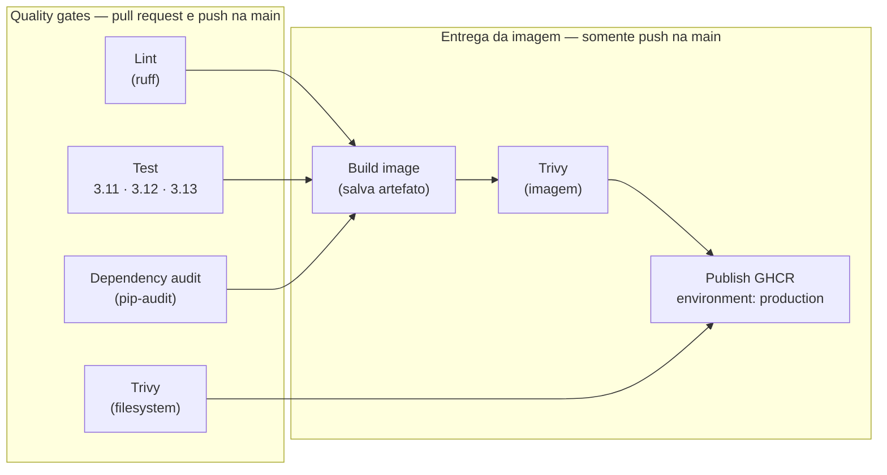
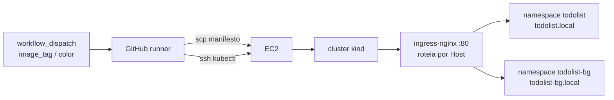

# Atividade 1 - CI/CD com GitHub


Pipeline de integração contínua em GitHub Actions atuando como *quality gate*:
nenhum código entra na `main` sem passar por lint, testes e scans de segurança.

## Grupo

- Matheus Barros
- Andre Marques
- Jackson Silva

## Aplicação

A aplicação vem do `cicd-starter-kit`: uma todolist em Flask com persistência em
SQLite via SQLAlchemy e autenticação por sessão.

Rotas relevantes:

| Rota | O que faz |
|---|---|
| `/login`, `/logout` | Autenticação por sessão |
| `/` | Lista, com formulário de criação |
| `/add`, `/toggle/<id>`, `/delete/<id>` | CRUD das tarefas |
| `/healthz` | Health check — executa `SELECT 1` no banco; usado pelos probes do Kubernetes |
| `/pods` | Lista os pods do namespace consultando a API do Kubernetes via ServiceAccount |
| `/cleanup/status` | Histórico do CronJob de limpeza e controle de suspend/resume |
| `/cleanup` | Remove tarefas concluídas; exige o header `X-Cleanup-Token` |

As rotas `/pods` e `/cleanup/status` só funcionam dentro de um cluster — fora
dele degradam com mensagem de erro em vez de quebrar. Elas são o insumo da
Atividade 2.

Configuração por variável de ambiente: `DATABASE_URI`, `SESSION_KEY`,
`ADMIN_USER`, `ADMIN_PASSWORD`, `CLEANUP_TOKEN`, `CLEANUP_JOB_PREFIX`,
`APP_NAME`, `APP_COLOR`, `APP_PORT` e `IMAGE_TAGS`.

## Estrutura do projeto

- `app.py`: aplicação Flask;
- `test_app.py`: suíte pytest (13 testes);
- `requirements.txt`: dependências de runtime, pinadas;
- `requirements-dev.txt`: dependências de CI e desenvolvimento — inclui
  `-r requirements.txt`, então instalar este arquivo instala os dois;
- `pyproject.toml`: configuração do Ruff;
- `Dockerfile`: imagem da aplicação, servida por gunicorn;
- `.github/workflows/ci.yml`: pipeline de CI;
- `.github/workflows/_reusable-test.yml`: workflow reutilizável com os steps de teste;
- `.github/CODEOWNERS`: revisores automáticos por caminho;
- `k8s/`: manifests de deploy (Rolling e Blue/Green) — usados na Atividade 2;
- `docs/`: referência das pipelines de CI e CD e do setup da VM de laboratório.

## Pré-requisitos

- Python 3.11 ou superior (o Ruff está configurado com `target-version = "py311"`)
- Git
- Docker (opcional — apenas para construir a imagem localmente)

## Como rodar os checks localmente

Os comandos abaixo são **os mesmos que o CI executa**. Funcionam em Linux, macOS
e WSL.

```bash
git clone https://github.com/MatheusBarros23/cicd-grupo-maj.git
cd cicd-grupo-maj

python3 -m venv .venv
source .venv/bin/activate
python -m pip install --upgrade pip
pip install -r requirements-dev.txt
```

Os três gates:

```bash
ruff check .   # lint        (job "Lint (ruff)")
pytest -v      # testes      (job "Test")
pip-audit      # dependências (job "Dependency audit (pip-audit)")
```

## Como rodar a aplicação localmente

O `DATABASE_URI` padrão é `sqlite:////data/todos.db` — caminho absoluto que
existe dentro do container, mas não na sua máquina. Localmente, aponte o banco
para o diretório atual:

```bash
DATABASE_URI=sqlite:///todos.db python app.py
```

A app sobe em `http://localhost:5000`. As credenciais padrão são `admin` /
`admin`, sobrescrevíveis por `ADMIN_USER` e `ADMIN_PASSWORD`.

Via container, o `/data` já existe na imagem e o padrão funciona sem ajuste:

```bash
docker build -t app-k8s-todolist .
docker run --rm -p 5000:5000 app-k8s-todolist
```

## Pipeline de CI

O workflow em `.github/workflows/ci.yml` dispara em `pull_request` para a `main`,
em `push` na `main` e manualmente via `workflow_dispatch`. O padrão de permissão
é `contents: read`, e só o job que precisa de mais eleva o próprio privilégio.
Todas as actions são fixadas por SHA de commit, não por tag — tag é mutável, e
quem controlar a conta do mantenedor passaria a executar código no pipeline com
acesso aos secrets.

O `concurrency` cancela runs anteriores da mesma ref: um push novo torna o run
antigo obsoleto, e não há motivo para pagar por ele até o fim.

### O que roda em cada evento

Não é o mesmo pipeline nos dois casos. Em pull request rodam apenas os gates de
código; o que envolve imagem só acontece depois que a mudança entra na `main`.



O `notify` ficou fora do diagrama de propósito: ele depende de todos os sete jobs
acima e roda com `if: always()`, então desenhar as sete arestas só poluiria a
topologia sem acrescentar informação.

Os quatro primeiros são os *quality gates* que bloqueiam o merge — são eles que
estão marcados como required status checks na proteção da `main`. Os três do meio
formam a cadeia de entrega da imagem, e não fazem sentido em PR: não se publica
imagem de código que ainda não foi aprovado.

Consequência prática: em pull request, `build`, `trivy_image` e `publish`
aparecem como **skipped**. Isso é o comportamento esperado, não falha — e é por
isso que nenhum deles pode ser marcado como required check, já que check que
nunca reporta em PR travaria o merge para sempre.

### Job `lint`

Roda `ruff check .` com as regras do `pyproject.toml` (`E`, `F`, `W`, `I`, `UP`,
`B`, com `E501` ignorado por causa dos templates HTML inline).

### Job `test`

Não tem steps próprios: chama o workflow reutilizável
`.github/workflows/_reusable-test.yml` via `uses:`, passando as versões do Python
como input. A matrix vive no chamador e a lógica de teste vive no reutilizável —
trocar as versões não toca nos steps, e mudar os steps não toca nas versões.

O reutilizável roda uma matrix de 3.11, 3.12 e 3.13 com `fail-fast: false`, e em
cada versão faz checkout, configura o Python, restaura o cache de `~/.cache/pip`
(chave por SO + versão do Python + hash dos requirements e do `pyproject.toml`),
instala as dependências e executa `pytest -v`.

### Job `security`

Executa `pip-audit` e falha se houver CVE com correção disponível. Rodamos sem
`-r`, sobre o ambiente já instalado: assim a auditoria alcança também as
dependências transitivas resolvidas, que não aparecem nos manifestos.

### Job `trivy`

Roda o Trivy em modo `scan-type: fs`, que analisa arquivos e manifestos do
repositório sem precisar buildar a imagem. Cobre mais que o `pip-audit`: além das
bibliotecas Python, alcança os pacotes do sistema operacional e outros
ecossistemas presentes no repo. Roda em todo `pull_request` e `push`, como
camada rápida de visibilidade (shift-left) — não depende do build da imagem.

Está com `exit-code: '0'` **de propósito** — aqui o Trivy é camada de
visibilidade, não gate. O bloqueio de dependências é responsabilidade do
`pip-audit`, que falha o build. Assim evitamos deixar a `main` eternamente
vermelha por CVE de pacote de sistema fora do nosso controle, sem perder o
relatório. `ignore-unfixed: true` reforça isso e `severity: HIGH,CRITICAL`
mantém o resultado no que é acionável.

O resultado sai em SARIF e vai para **Security → Code scanning**, o que explica o
`security-events: write` nas `permissions` deste job — e só dele; todos os outros
ficam com `contents: read`. O mesmo SARIF sobe como artefato do run
(`trivy-fs-results`), garantindo acesso ao relatório de qualquer forma.

Este é o **único** job que alimenta o code scanning, e isso é deliberado. A regra
"Require code scanning results" na proteção da `main` cobra resultados em pull
request; como este job roda nos dois eventos, ela sempre encontra o que espera.

### Job `build`

Depende de `lint`, `test` e `security`, e só executa em `push` na `main` — nunca
em pull request, para não pagar o custo de build em todo PR. Builda a imagem
Docker localmente (`push: false`, `load: true`), salva com `docker save` e sobe
como artefato do run (`docker-image`). Essa é a mesma imagem que os jobs
seguintes escaneiam e publicam — não há rebuild entre o scan e o push.

O `build-arg IMAGE_TAGS` é injetado aqui, e não no `publish`: no `Dockerfile` ele
vira `ENV` gravado em build time, então precisa existir no momento em que a
imagem é construída. A aplicação lê essa variável e exibe a tag no rodapé — dá
para abrir a app e confirmar visualmente qual build está no ar.

### Job `trivy_image`

Depende de `build` e só executa em `push` na `main`. Baixa o artefato da imagem,
carrega com `docker load` e roda o Trivy em modo `scan-type: image` sobre ela —
complementando o scan de filesystem com o que só aparece na imagem final
(camadas da base image, pacotes de sistema instalados no build). Mesma política
de `exit-code: '0'`/`ignore-unfixed`/`severity` do job `trivy`, pelo mesmo motivo:
visibilidade, não gate.

A saída aqui é `format: table`, no log do job, e **não** sobe SARIF. O motivo é
concreto: o code scanning memoriza cada categoria que recebe e passa a exigi-la
nos commits seguintes. Como este job é push-only, a categoria dele nunca
apareceria em pull request, e a regra "Require code scanning results" travaria
todo merge esperando um resultado que não vem. Por não subir SARIF, este job
também não precisa de `security-events: write`.

### Job `publish`

Depende de `lint`, `test`, `security`, `trivy`, `build` e `trivy_image`, e só
executa em `push` na `main` — nunca em pull request. Está associado ao
environment `production`, o que exige aprovação humana antes de publicar. Baixa
o artefato de imagem gerado pelo job `build` (não builda de novo), faz login no
GitHub Container Registry com o `GITHUB_TOKEN` do próprio workflow — sem PAT e
sem credencial commitada — e publica a imagem com duas tags: o SHA do commit
(que é o que permite rollback) e `latest`. O nome do owner é normalizado para
minúsculas porque referências de registry não aceitam maiúsculas.

As duas tags têm papéis distintos. O SHA é imutável: é ele que permite saber
exatamente qual código está rodando e voltar para um ponto específico num
rollback. O `latest` é conveniência, para quem só quer o topo da `main`. O deploy
da Atividade 2 deve referenciar o SHA, não o `latest`.

Vale notar o que o `publish` **não** faz: ele não builda. Só carrega o artefato,
aplica a segunda tag e dá `docker push`. Isso é deliberado — se ele reconstruísse
a imagem, publicaria bytes diferentes dos que o `trivy_image` auditou, e a cadeia
de scan perderia sentido.

### Job `notify`

Roda com `if: always()`, justamente para avisar quando algo falhou — um job que
dependesse do sucesso dos anteriores nunca notificaria a falha, que é o caso que
importa.

O status é `SUCESSO` só se `lint`, `test`, `security` e `trivy` tiverem passado, e
se `build`, `trivy_image` e `publish` não tiverem falhado. A distinção é
necessária: em pull request esses três são *skipped*, e exigir `success` deles
daria falso negativo em todo PR.

O payload é montado com `jq` em vez de string interpolada, para que nome de branch
com caractere especial não quebre o JSON. O formato é o do Discord (`embeds`), e
inclui sempre o link do run — notificação que não leva ao log gera mais pergunta
que resposta. O envio é pulado enquanto o secret `NOTIFY_WEBHOOK_URL` não existir,
para que a ausência de webhook não deixe o pipeline vermelho.

## Como demonstrar o shift-left

O objetivo é mostrar o gate **bloqueando um merge** e depois liberando-o.

### Falha de segurança (demonstração principal)

O `requirements.txt` fixa `requests==2.33.0`. Rebaixar essa versão introduz
vulnerabilidades conhecidas com correção disponível, que é exatamente o que o
`pip-audit` reprova:

```bash
git checkout -b demo/falha-seguranca
# em requirements.txt: requests==2.33.0  ->  requests==2.31.0
git commit -am "chore: rebaixa requests para demonstrar o gate"
git push origin demo/falha-seguranca
```

1. Abra o pull request;
2. o job `Dependency audit (pip-audit)` fica vermelho e lista os CVEs;
3. o merge é bloqueado pelo required status check;
4. **no mesmo PR**, volte para `requests==2.33.0`;
5. o check fica verde e o merge é liberado.

Custo da correção: 1x, no mesmo PR que introduziu o problema. Sem esse gate, a
versão vulnerável entraria na `main` e seria descoberta num scan tardio — ou num
incidente.

### Falha de teste (demonstração complementar)

```bash
git checkout -b demo/falha-teste
# em test_app.py, troque uma asserção por algo incorreto, ex.:
#   assert resp.status_code == 500   em test_healthz
```

O job `Test` fica vermelho e o log do `pytest` mostra exatamente qual asserção
falhou, em qual versão do Python.

## Arquitetura de deploy (CD)

O deploy leva uma imagem já publicada no GHCR até um cluster `kind` que roda numa
EC2. O runner hospedado do GitHub faz papel de **operador remoto**: ele já tem o
repositório em checkout, então copia o manifesto por `scp` e executa `kubectl` por
`ssh`. Nada é clonado dentro da VM.



Decisão deliberada: **não usamos runner self-hosted.** Ele daria acesso direto ao
cluster, mas em repositório público qualquer pessoa poderia abrir um PR e executar
código arbitrário na instância. O custo é precisar da chave SSH como secret.

Os Services são todos `ClusterIP` — nada de NodePort. A entrada é sempre o
ingress-nginx na porta 80 do nó, com roteamento por `Host`. Consequência prática:
adicionar rota é aplicar um `Ingress`, sem abrir porta no Security Group.

As duas estratégias **coexistem**, em namespaces e hosts distintos, então dá para
demonstrar uma depois da outra sem teardown no meio.

| Estratégia | Workflow(s) | Namespace | Host |
|---|---|---|---|
| Rolling Update | `cd.yml` | `todolist` | `todolist.local` |
| Blue/Green | `cd-blue-green.yml` + `cd-blue-green-switch.yml` | `todolist-bg` | `todolist-bg.local` (produção), `blue.`/`green.todolist-bg.local` (slots) |

Todos os três são `workflow_dispatch`: deploy é decisão, não consequência
automática de um merge.

### Rolling Update — `cd.yml`

Input: `image_tag`. O workflow deriva a referência completa da imagem de
`github.repository_owner` (a mesma lógica do job `publish`), reescreve a linha
`image:` do `k8s/todolist.yaml` com `sed`, copia por `scp` e aplica.

O `kubectl rollout status --timeout=120s` é o **gate**: `kubectl apply` num
Deployment aciona o RollingUpdate, que sobe o pod novo, espera a `readinessProbe`
e só então remove o antigo. Se o pod novo não fica `Ready`, o step falha.

O último step é o smoke test: `curl -H "Host: todolist.local" .../healthz` através
do ingress, com retry. Prova o caminho inteiro — ingress → Service → pod → banco.

### Blue/Green — deploy e switch separados

As duas operações estão em workflows distintos de propósito: preparar a versão é
uma ação, virar o tráfego é outra.

**`cd-blue-green.yml`** — inputs `color` e `image_tag`. Aplica o
`k8s/blue-green/bootstrap.yaml` se o namespace ainda não existir, faz
`kubectl set image` **somente no Deployment da cor escolhida**, espera o rollout e
faz smoke test no host fixo do slot (`green.todolist-bg.local`). Não toca em
produção. Se a cor escolhida já for a ativa, emite um warning — publicar na cor que
está em produção anula a rede de proteção da estratégia.

**`cd-blue-green-switch.yml`** — input `color`. Antes de virar, confirma que o slot
alvo responde no `/healthz` do host dele; slot doente **aborta o cutover** com
produção intacta. O switch em si é um `kubectl patch` no selector do Service de
produção:

```bash
kubectl patch svc todolist -n todolist-bg \
  -p '{"spec":{"selector":{"app":"todolist","color":"green"}}}'
```

**Ingress e hosts nunca mudam.** Essa é a decisão central: o cutover é uma mudança
mínima em dado declarativo, e é justamente o que o torna instantâneo e reversível.
Trocar tráfego recriando o Ingress funcionaria, mas perderia essa propriedade.

Cada Deployment sobe com o seu `APP_COLOR`, então a interface muda de cor no
switch — o efeito é visível a olho nu, sem precisar olhar log.

### Como fazer rollback

**Blue/Green — imediato.** Rode o `cd-blue-green-switch.yml` novamente com a cor
anterior. Funciona na hora porque a cor antiga **continua rodando**: não escalamos
para zero. O log do switch imprime o comando exato, incluindo a cor de onde você
veio, para servir na hora do incidente.

```bash
gh workflow run cd-blue-green-switch.yml -f color=blue
```

**Rolling Update — não é automático.** Duas opções:

```bash
# redeployar a tag anterior pelo proprio pipeline
gh workflow run cd.yml -f image_tag=<sha-anterior>

# ou desfazer a ultima revisao, na VM
kubectl rollout undo deployment/todolist -n todolist
```

Rollback automático no rolling exigiria `helm upgrade --atomic`. É limitação
consciente, não esquecimento.

### Antes de rodar qualquer deploy

Valide o canal: **Actions → Validate SSH to EC2 → Run workflow**. Ele entra na EC2,
seleciona o contexto do kind e lista os namespaces. Deploy sobre canal não validado
transforma erro de infra em erro de pipeline, e você debuga o lugar errado.

Secrets e variables necessários:

| Nome | Tipo | Para quê |
|---|---|---|
| `EC2_SSH_KEY` | secret | chave privada completa, de `BEGIN` a `END` |
| `EC2_HOST` | secret | IPv4 público da EC2 |
| `EC2_USER` | secret | usuário SSH da VM |
| `KIND_CLUSTER` | **variable** | nome do cluster kind (default `devops-labs`) |

> **A pegadinha do IP:** o IPv4 público muda a cada stop/start da EC2. Atualize o
> `EC2_HOST` **antes** de rodar qualquer workflow — o sintoma de esquecer é
> `Connection timed out` em todos os deploys.

Para acessar pelo navegador, mapeie os hosts no seu `/etc/hosts`:

```
<IP_PUBLICO_DA_EC2> todolist.local todolist-bg.local blue.todolist-bg.local green.todolist-bg.local
```

### Persistência: SQLite em `emptyDir`

O banco fica em `/data/todos.db` num volume que vive e morre com o pod. Isso é
escolha deliberada para manter o lab leve, e tem consequências que vale nomear:
cada pod tem o seu banco, reiniciar o pod zera os dados, e trocar de cor no
blue/green "reinicia" a lista porque é outro Deployment. Como só uma cor serve
produção por vez, não há incoerência de leitura — mas não há continuidade.

É também por isso que Canary não caberia aqui: canary manda tráfego para as duas
versões ao mesmo tempo, e com um banco por pod o mesmo usuário veria listas
diferentes a cada request. Continuidade exigiria um `PersistentVolumeClaim` ou banco
externo, e isso é ortogonal à estratégia de deploy.

